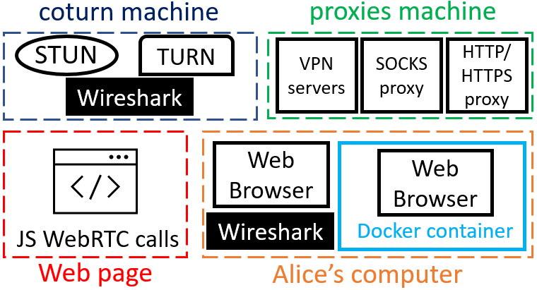

# Test bed



Our test bed is a system composed of:

- *a public STUN server and a public TURN server*, located on the same machine, implemented by ***coturn*** [[1](#references)]. Our STUN/TURN servers do not exploit the DNS wildcard entry attack described by Roesler [[2](#references)].
- *a web page*, that is accessible online, and which is in charge of executing a call to the WebRTC API to generate ICE offers locally in the calling web browser<sup>[1](#footnote-1)</sup>. The list of candidates is generated and displayed locally.
- *a web client*, executed either natively or within a Docker container. Indeed, to improve WebRTC privacy, we propose to isolate the web browser in a container that provides a single interface attaching a private IPv4 address and, additionally for Linux systems, an IPv6 ULA address<sup>[2](#footnote-2)</sup> [[4](#references)], both of which can be routed to the Internet via NAT rules.
Besides, we consider two versions of the web client, one that is honest (running with default settings), and another one that is compromised for WebRTC. Docker was chosen  due to its cross-platform advantage. The solution has been implemented on Linux, macOS and Windows. The user runs one script to use the solution.
- *a VPN server, a SOCKS and a HTTP/S proxy* behind which the web client can hide. Our Wireshark analysis shows that our VPNs are correctly configured, there is no leak unrelated to WebRTC at this point.


<small id="footnote-1"><sup>[1](#test-bed)</sup> The JavaSript codes we produce are based on Reiter and Marsalek work [[3](#references)]. They are available [here](3-web-page/README.md#2-information-about-the-scripts-used-on-the-web-page).</small><br>
<small id="footnote-2"><sup>[2](#test-bed)</sup> Docker does not support IPv6 on Mac and Windows: <a href="https://docs.docker.com/config/daemon/ipv6/">https://docs.docker.com/config/daemon/ipv6/</a> [accessed on 14 June 2024].</small>


## Table of contents

[Overview](#overview)  
[Note](#note)  
[1. STUN and TURN server deployment and configuration](#1-stun-and-turn-server-deployment-and-configuration)  
&nbsp;&nbsp;&nbsp;&nbsp;&nbsp;&nbsp;[1.1. Configuration overview](#11-configuration-overview)  
&nbsp;&nbsp;&nbsp;&nbsp;&nbsp;&nbsp;[1.2. Server and networks deployment](#12-server-and-networks-deployment)  
&nbsp;&nbsp;&nbsp;&nbsp;&nbsp;&nbsp;[1.3. STUN/TURN server configuration](#13-stunturn-server-configuration)  
[2. VPN, SOCKS and HTTP/HTTPS proxy deployment and configuration](#2-vpn-socks-and-httphttps-proxy-deployment-and-configuration)  
&nbsp;&nbsp;&nbsp;&nbsp;&nbsp;&nbsp;[2.1. Configuration overview](#21-configuration-overview)  
&nbsp;&nbsp;&nbsp;&nbsp;&nbsp;&nbsp;[2.2. Server and networks deployment](#22-server-and-networks-deployment)  
&nbsp;&nbsp;&nbsp;&nbsp;&nbsp;&nbsp;[2.3. Installing the TShark network analyser](#23-installing-the-tshark-network-analyser)  
&nbsp;&nbsp;&nbsp;&nbsp;&nbsp;&nbsp;[2.4. VPN servers configuration](#24-vpn-servers-configuration)  
&nbsp;&nbsp;&nbsp;&nbsp;&nbsp;&nbsp;&nbsp;&nbsp;&nbsp;&nbsp;&nbsp;&nbsp;[2.4.1. Setting up the OpenVPN UDP VPN server](#241-setting-up-the-openvpn-udp-vpn-server)  
&nbsp;&nbsp;&nbsp;&nbsp;&nbsp;&nbsp;&nbsp;&nbsp;&nbsp;&nbsp;&nbsp;&nbsp;[2.4.2. Setting up the WireGuard VPN server](#242-setting-up-the-wireguard-vpn-server)  
&nbsp;&nbsp;&nbsp;&nbsp;&nbsp;&nbsp;[2.5. Proxy servers configuration](#25-proxy-servers-configuration)  
&nbsp;&nbsp;&nbsp;&nbsp;&nbsp;&nbsp;&nbsp;&nbsp;&nbsp;&nbsp;&nbsp;&nbsp;[2.5.1. Setting up the Dante SOCKSv5 proxy server](#251-setting-up-the-dante-socksv5-proxy-server)  
&nbsp;&nbsp;&nbsp;&nbsp;&nbsp;&nbsp;&nbsp;&nbsp;&nbsp;&nbsp;&nbsp;&nbsp;[2.5.2. Setting up the mitmproxy HTTP/HTTPS proxy server](#252-setting-up-the-mitmproxy-httphttps-proxy-server)  
[3. Testing the WebRTC IP adress leak](#3-testing-the-webrtc-ip-adress-leak)  
[4. WebRTC client configurations](#4-webrtc-client-configurations)  
&nbsp;&nbsp;&nbsp;&nbsp;&nbsp;&nbsp;[4.1. Install web browsers on the host machine](#41-install-web-browsers-on-the-host-machine)  
&nbsp;&nbsp;&nbsp;&nbsp;&nbsp;&nbsp;[4.2. Containerised web browser solution](#42-containerised-web-browser-solution)  
&nbsp;&nbsp;&nbsp;&nbsp;&nbsp;&nbsp;&nbsp;&nbsp;&nbsp;&nbsp;&nbsp;&nbsp;[4.2.1. Linux](#421-linux-ubuntu)  
&nbsp;&nbsp;&nbsp;&nbsp;&nbsp;&nbsp;&nbsp;&nbsp;&nbsp;&nbsp;&nbsp;&nbsp;&nbsp;&nbsp;&nbsp;&nbsp;&nbsp;&nbsp;[4.2.1.0. Prerequisites](#4210-prerequisites)  
&nbsp;&nbsp;&nbsp;&nbsp;&nbsp;&nbsp;&nbsp;&nbsp;&nbsp;&nbsp;&nbsp;&nbsp;&nbsp;&nbsp;&nbsp;&nbsp;&nbsp;&nbsp;[4.2.1.1. Wayland version (Mutter)](#4211-wayland-version-mutter)  
&nbsp;&nbsp;&nbsp;&nbsp;&nbsp;&nbsp;&nbsp;&nbsp;&nbsp;&nbsp;&nbsp;&nbsp;&nbsp;&nbsp;&nbsp;&nbsp;&nbsp;&nbsp;[4.2.1.2. X version (X.Org/XWayland)](#4212-x-version-xorgxwayland)  
&nbsp;&nbsp;&nbsp;&nbsp;&nbsp;&nbsp;&nbsp;&nbsp;&nbsp;&nbsp;&nbsp;&nbsp;[4.2.2. Windows](#422-windows)  
&nbsp;&nbsp;&nbsp;&nbsp;&nbsp;&nbsp;&nbsp;&nbsp;&nbsp;&nbsp;&nbsp;&nbsp;&nbsp;&nbsp;&nbsp;&nbsp;&nbsp;&nbsp;[4.2.2.0. Prerequisites](#4220-prerequisites)  
&nbsp;&nbsp;&nbsp;&nbsp;&nbsp;&nbsp;&nbsp;&nbsp;&nbsp;&nbsp;&nbsp;&nbsp;&nbsp;&nbsp;&nbsp;&nbsp;&nbsp;&nbsp;[4.2.2.1. Wayland version (Weston)](#4221-wayland-version-weston)  
&nbsp;&nbsp;&nbsp;&nbsp;&nbsp;&nbsp;&nbsp;&nbsp;&nbsp;&nbsp;&nbsp;&nbsp;&nbsp;&nbsp;&nbsp;&nbsp;&nbsp;&nbsp;[4.2.2.2. X version (XWayland)](#4222-x-version-xwayland)  
&nbsp;&nbsp;&nbsp;&nbsp;&nbsp;&nbsp;&nbsp;&nbsp;&nbsp;&nbsp;&nbsp;&nbsp;[4.2.3. macOS](#423-macos)  
&nbsp;&nbsp;&nbsp;&nbsp;&nbsp;&nbsp;&nbsp;&nbsp;&nbsp;&nbsp;&nbsp;&nbsp;&nbsp;&nbsp;&nbsp;&nbsp;&nbsp;&nbsp;[4.2.3.0. Prerequisites](#4230-prerequisites)  
&nbsp;&nbsp;&nbsp;&nbsp;&nbsp;&nbsp;&nbsp;&nbsp;&nbsp;&nbsp;&nbsp;&nbsp;&nbsp;&nbsp;&nbsp;&nbsp;&nbsp;&nbsp;[4.2.3.1. X version (XQuartz)](#4231-x-version-xquartz)  
&nbsp;&nbsp;&nbsp;&nbsp;&nbsp;&nbsp;[4.3. Compromised Firefox web browser](#43-compromised-firefox-web-browser)  
&nbsp;&nbsp;&nbsp;&nbsp;&nbsp;&nbsp;&nbsp;&nbsp;&nbsp;&nbsp;&nbsp;&nbsp;[4.3.1. Threat model](#431-threat-model)  
&nbsp;&nbsp;&nbsp;&nbsp;&nbsp;&nbsp;&nbsp;&nbsp;&nbsp;&nbsp;&nbsp;&nbsp;[4.3.2. Compromising tools](#432-compromising-tools)  
&nbsp;&nbsp;&nbsp;&nbsp;&nbsp;&nbsp;&nbsp;&nbsp;&nbsp;&nbsp;&nbsp;&nbsp;&nbsp;&nbsp;&nbsp;&nbsp;&nbsp;&nbsp;[4.3.2.1. Compromised configuration used in our evaluation](#4321-compromised-configuration-used-in-our-evaluation)  
&nbsp;&nbsp;&nbsp;&nbsp;&nbsp;&nbsp;&nbsp;&nbsp;&nbsp;&nbsp;&nbsp;&nbsp;&nbsp;&nbsp;&nbsp;&nbsp;&nbsp;&nbsp;&nbsp;&nbsp;&nbsp;&nbsp;&nbsp;&nbsp;[4.3.2.1.1. Host configuration](#43211-host-configuration)  
&nbsp;&nbsp;&nbsp;&nbsp;&nbsp;&nbsp;&nbsp;&nbsp;&nbsp;&nbsp;&nbsp;&nbsp;&nbsp;&nbsp;&nbsp;&nbsp;&nbsp;&nbsp;&nbsp;&nbsp;&nbsp;&nbsp;&nbsp;&nbsp;[4.3.2.1.2. Containerised compromised web browser](#43212-containerised-compromised-web-browser)  
&nbsp;&nbsp;&nbsp;&nbsp;&nbsp;&nbsp;&nbsp;&nbsp;&nbsp;&nbsp;&nbsp;&nbsp;&nbsp;&nbsp;&nbsp;&nbsp;&nbsp;&nbsp;[4.3.2.2. Other compromised configuration allowing the installation of extensions not signed by Mozilla [19]](#4322-other-compromised-configuration-allowing-the-installation-of-extensions-not-signed-by-mozilla-19)  
[5. Automated reproduction of results](#5-automated-reproduction-of-results)  
&nbsp;&nbsp;&nbsp;&nbsp;&nbsp;&nbsp;[5.1. Automated reproduction of IP address leak results](#51-automated-reproduction-of-ip-address-leak-results)  
&nbsp;&nbsp;&nbsp;&nbsp;&nbsp;&nbsp;&nbsp;&nbsp;&nbsp;&nbsp;&nbsp;&nbsp;[5.1.1. Linux](#511-linux)  
&nbsp;&nbsp;&nbsp;&nbsp;&nbsp;&nbsp;&nbsp;&nbsp;&nbsp;&nbsp;&nbsp;&nbsp;&nbsp;&nbsp;&nbsp;&nbsp;&nbsp;&nbsp;[5.1.1.0. Prerequisites](#5110-prerequisites)  
&nbsp;&nbsp;&nbsp;&nbsp;&nbsp;&nbsp;&nbsp;&nbsp;&nbsp;&nbsp;&nbsp;&nbsp;&nbsp;&nbsp;&nbsp;&nbsp;&nbsp;&nbsp;[5.1.1.1. Wayland version (Mutter)](#5111-wayland-version-mutter)  
&nbsp;&nbsp;&nbsp;&nbsp;&nbsp;&nbsp;&nbsp;&nbsp;&nbsp;&nbsp;&nbsp;&nbsp;&nbsp;&nbsp;&nbsp;&nbsp;&nbsp;&nbsp;[5.1.1.2. X version (X.Org/XWayland)](#5112-x-version-xorgxwayland)  
&nbsp;&nbsp;&nbsp;&nbsp;&nbsp;&nbsp;&nbsp;&nbsp;&nbsp;&nbsp;&nbsp;&nbsp;[5.1.2. Windows](#512-windows)  
&nbsp;&nbsp;&nbsp;&nbsp;&nbsp;&nbsp;&nbsp;&nbsp;&nbsp;&nbsp;&nbsp;&nbsp;[5.1.3. macOS](#513-macos)  
&nbsp;&nbsp;&nbsp;&nbsp;&nbsp;&nbsp;[5.2. Automated reproduction of performance results](#52-automated-reproduction-of-performance-results)  
&nbsp;&nbsp;&nbsp;&nbsp;&nbsp;&nbsp;&nbsp;&nbsp;&nbsp;&nbsp;&nbsp;&nbsp;[5.2.1. Linux](#521-linux)  
&nbsp;&nbsp;&nbsp;&nbsp;&nbsp;&nbsp;&nbsp;&nbsp;&nbsp;&nbsp;&nbsp;&nbsp;&nbsp;&nbsp;&nbsp;&nbsp;&nbsp;&nbsp;[5.2.1.1. Wayland version (Mutter)](#5211-wayland-version-mutter)  
&nbsp;&nbsp;&nbsp;&nbsp;&nbsp;&nbsp;&nbsp;&nbsp;&nbsp;&nbsp;&nbsp;&nbsp;&nbsp;&nbsp;&nbsp;&nbsp;&nbsp;&nbsp;[5.2.1.2. X version (X.Org/XWayland)](#5212-x-version-xorgxwayland)  
&nbsp;&nbsp;&nbsp;&nbsp;&nbsp;&nbsp;&nbsp;&nbsp;&nbsp;&nbsp;&nbsp;&nbsp;[5.2.2. Windows](#522-windows)  
&nbsp;&nbsp;&nbsp;&nbsp;&nbsp;&nbsp;&nbsp;&nbsp;&nbsp;&nbsp;&nbsp;&nbsp;[5.2.3. macOS](#523-macos)  
&nbsp;&nbsp;&nbsp;&nbsp;&nbsp;&nbsp;[5.3. Analysing the results](#53-analysing-the-results)  
[References](#references)


## Overview

There are four folders:
 - [`1-stun-turn-setup`](1-stun-turn-setup/README.md), containing the configuration instructions for the STUN and TURN servers;
 - [`2-vpn-socks-http-https-proxy-setup`](2-vpn-socks-http-https-proxy-setup/README.md), containing the configuration instructions for the VPNs, SOCKS and HTTP/HTTPS proxies;
 - [`3-web-page`](3-web-page/README.md), containing the web page that execute a call to the WebRTC API to generate ICE offers locally;
 - [`4-webrtc-client-setup`](4-webrtc-client-setup/README.md), containing the differents WebRTC client configurations (vanilla, containerised, compromised, etc. web browser).

## Note

For privacy purposes, all public IP addresses have been anonymised using those reserved for documentation given in RFC 5737 for IPv4 [[5](#references)] and RFC 3849 for IPv6 [[6](#references)].

## 1. STUN and TURN server deployment and configuration

### 1.1. Configuration overview

<table>
    <tr>
        <th>Public IPv4 address</th>
        <th>Public IPv6 address</th>
        <th>Private IPv4 address</th>
        <th>Operating System</th>
        <th>Architecture</th>
        <th>Service</th>
        <th>Version</th>
        <th>Listening port</th>
    </tr>
    <tr>
        <td rowspan="2">192.0.2.1</td>
        <td rowspan="2">2001:db8::1</td>
        <td rowspan="2">10.132.0.8</td>
        <td rowspan="2">Ubuntu Server 22.04 LTS</td>
        <td rowspan="2">arm64</td>
        <td>coturn</td>
        <td>4.5.2</td>
        <td>5349 (TLS)</td>
    </tr>
    <tr>
        <td>TShark</td>
        <td>4.2.5</td>
        <td>N/A</td>
    </tr>
</table>


### 1.2. Server and networks deployment

You can manually deploy a VM/VPS/machine to obtain the configuration described in the previous table.

In our case, we used the Google Cloud Platform to automatically generate the networks and VMs. The generation Google Cloud script is located there: [`0-stun-turn-gcloud-deployment-commands.sh`](1-stun-turn-setup/0-stun-turn-gcloud-deployment-commands.sh). Please change the IP addresses in this file to those provided by Google, as well as the SSH key to connect to the machines using your own.

### 1.3. STUN/TURN server configuration

1. Enter the *STUN/TURN machine* via SSH.

```bash
ssh username@192.0.2.1
```

2. Install coturn and tshark.

```bash
sudo apt update && sudo apt install coturn tshark
```

3. Enable the TURN server.

```bash
sudo nano /etc/default/coturn
```

Make sure that the TURN server is enabled:

```ini
# /etc/default/coturn
# ...

TURNSERVER_ENABLED=1
# ...
```

4. Configure the TURN server.

```bash
sudo mv /etc/turnserver.conf /etc/turnserver.conf.original

sudo nano /etc/turnserver.conf
```

Paste the following configuration, be careful to set the `TURN_USERNAME`, `TURN_PASSWORD` and `DOMAIN_NAME_OF_THE_TURN_SERVER_PROVIDER` fields:


```ini
# /etc/turnserver.conf

listening-port=3478
tls-listening-port=5349
# The "external-ip" value, if not empty, is returned in XOR-RELAYED-ADDRESS field. (doc du fichier de conf), puis : 
# MDN: For relay candidates, the related address and port are set to the mapped address selected by the TURN server. 
# rfc 8656 STUN https://www.rfc-editor.org/rfc/rfc8656.html
external-ip=192.0.2.1/10.132.0.8

fingerprint
lt-cred-mech

cli-password=[TO BE GENERATED WITH turnadmin -P -p <password>]

user=TURN_USERNAME:TURN_PASSWORD
total-quota=100
stale-nonce=600

proc-user=turnserver
proc-group=turnserver

realm=DOMAIN_NAME_OF_THE_TURN_SERVER_PROVIDER

cert=/usr/local/etc/turn_server_cert.pem
pkey=/usr/local/etc/turn_server_pkey.pem
```

5. Create a TLS certificate.

```bash
sudo openssl req -newkey rsa:4096 -x509 -sha256 -days 365 -nodes -out /usr/local/etc/turn_server_cert.pem -keyout /usr/local/etc/turn_server_pkey.pem

sudo chown turnserver:turnserver /usr/local/etc/turn_server_cert.pem
sudo chmod 644 /usr/local/etc/turn_server_cert.pem
sudo chown turnserver:turnserver /usr/local/etc/turn_server_pkey.pem
sudo chmod 600 /usr/local/etc/turn_server_pkey.pem
```

6. Create a coturn systemd service.

```bash
sudo nano /lib/systemd/system/coturn.service  
```

```ini
[Unit]
Description=coTURN STUN/TURN Server
Documentation=man:coturn(1) man:turnadmin(1) man:turnserver(1)
After=network.target

[Service]
User=root
Group=root
Type=notify
ExecStart=/usr/bin/turnserver -c /etc/turnserver.conf
Restart=on-failure
InaccessibleDirectories=/home
PrivateTmp=yes

[Install]
WantedBy=multi-user.target
```

7. Enable it, start it and check for the status:

```
sudo systemctl daemon-reload
sudo systemctl enable coturn.service
sudo systemctl start coturn.service
sudo systemctl status coturn.service
```

If the service is active, you can close the SSH session. Otherwise, please look at the coturn project documentation [[1](#references)].

## 2. VPN, SOCKS and HTTP/HTTPS proxy deployment and configuration

### 2.1. Configuration overview

<table>
    <tr>
        <th>Public IPv4 address</th>
        <th>Public IPv6 address</th>
        <th>Private IPv4 address</th>
        <th>Operating System</th>
        <th>Architecture</th>
        <th>Service</th>
        <th>Version</th>
        <th>Listening port</th>
        <th>Virtual private IPv4 network</th>
        <th>Virtual private IPv6 network</th>
    </tr>
    <tr>
        <td rowspan="5">198.51.100.1</td>
        <td rowspan="5">2001:db8::2</td>
        <td rowspan="5">192.168.1.91</td>
        <td rowspan="5">Ubuntu Server 24.04 LTS</td>
        <td rowspan="5">arm64</td>
        <td>OpenVPN UDP</td>
        <td>2.6.9</td>
        <td>1194</td>
        <td>10.7.0.0/24</td>
        <td>fddd:1194:1194:1194::/64</td>
    </tr>
    <tr>
        <td>WireGuard</td>
        <td>1.0.20210914</td>
        <td>2050</td>
        <td>10.8.0.0/24</td>
        <td>fd4c:61b4:9648::/64</td>
    </tr>
    <tr>
        <td>Dante SOCKS5 proxy</td>
        <td>1.4.3</td>
        <td>1080</td>
        <td colspan="2">N/A</td>
    </tr>
    <tr>
        <td>mitmproxy HTTP/HTTPS proxy</td>
        <td>8.1.1</td>
        <td>8081</td>
        <td colspan="2">N/A</td>
    </tr>
    <tr>
        <td>TShark</td>
        <td>4.2.5</td>
        <td colspan="3">N/A</td>
    </tr>
</table>

Each VPN (OpenVPN and WireGuard) provides one IPv4 (or IPv6) tunnel per client with IPv4 and IPv6 packet forwarding capabilities thanks to their IPv4 and IPv6 virtual networks. A virtual interface per VPN attaching a private IPv4 and IPv6 will therefore be offered to the VPN client.


### 2.2. Server and networks deployment

You can manually deploy a VM/VPS/machine to obtain the configuration described in the previous table.

In our case, we used the Google Cloud Platform to automatically generate the networks and VMs. The generation Google Cloud script is located there: [`0-vpn-socks-http-https-gcloud-deployment-commands.sh`](2-vpn-socks-http-https-proxy-setup/0-vpn-socks-http-https-gcloud-deployment-commands.sh). Please change the IP addresses in this file to those provided by Google, as well as the SSH key to connect to the machines using your own.

### 2.3. Installing the TShark network analyser

1. Enter the machine via SSH.

```bash
ssh username@198.51.100.1
```

2. Install tshark.

```bash
sudo apt update && sudo apt install tshark
```

### 2.4. VPN servers configuration

#### 2.4.1. Setting up the OpenVPN UDP VPN server

Please follow this online guide which contains a road warrior script [[7](#references)] automating the installation of the server: https://www.cyberciti.biz/faq/ubuntu-22-04-lts-set-up-openvpn-server-in-5-minutes/ [Accessed on May 24, 2024].

#### 2.4.2. Setting up the WireGuard VPN server

Please follow this online guide: https://www.digitalocean.com/community/tutorials/how-to-set-up-wireguard-on-ubuntu-22-04 [Accessed on May 24, 2024].

If you experience some problems with DNS, please read this blog post: https://www.procustodibus.com/blog/2022/03/wireguard-dns-config-for-systemd/ [Accessed on May 24, 2024].


### 2.5. Proxy servers configuration

#### 2.5.1. Setting up the Dante SOCKSv5 proxy server


1. Enter the *VPNs/SOCKS/HTTP/HTTPS proxies machine* via SSH.

```bash
ssh username@198.51.100.1
```

2. Install the Dante SOCKS server and tshark.

```bash
sudo apt update && sudo apt install dante-server tshark
```

3. Enable the Dante server.

```bash
sudo nano /etc/danted.conf
```

Edit the configuration file as follows:
```ini
#logging
logoutput: syslog
user.privileged: root
user.unprivileged: nobody

# listening network interface and protocols
internal.protocol: ipv4 ipv6
internal: wlan0

# proxying network interface and protocols
external.protocol: ipv4 ipv6
external: wlan0

# authentication methods
socksmethod: none
clientmethod: none

#allow connections from any ipv4 and ipv6 clients
client pass {
    from: 0/0 to: 0/0
}

socks pass {
    from: 0/0 to: 0/0
}
```

More information about the server configuration file: https://www.inet.no/dante/doc/latest/config/server.html (Accessed: May 24, 2024).

4. Enable the danted service, start it and check for the status:

```bash
sudo systemctl daemon-reload
sudo systemctl enable danted.service
sudo systemctl start danted.service
sudo systemctl status danted.service
```

5. Make sure that your firewall allows connections to port 1080.

```bash
sudo ufw allow 1080
```

If the service is active, you can close the SSH session. Otherwise, please look at the Dante project documentation [[8](#references)].


#### 2.5.2. Setting up the mitmproxy HTTP/HTTPS proxy server

1. Enter the machine via SSH.

```bash
ssh username@198.51.100.1
```

2. Install the mitmproxy HTTP/HTTPS proxy.

```bash
sudo apt update && sudo apt install mitmproxy
```

3. Create a mitmproxy systemd service.

```bash
sudo nano /etc/systemd/system/mitmdump.service 
```

Please change `username` with a non-root username.

```ini
[Unit]
Description=mitmdump service
After=network.target

[Service]
Type=simple
User=[username]
ExecStart=mitmdump --set block_global=false -p 8081 &>> /var/log/mitmdump.log
Restart=always
RestartSec=1

[Install]
WantedBy=multi-user.target
```


4. Enable the mitmproxy service, start it and check for the status:

```bash
sudo systemctl daemon-reload
sudo systemctl enable mitmdump.service
sudo systemctl start mitmdump.service
sudo systemctl status mitmdump.service
```

5. Make sure that your firewall allows connections to port 8081.

```bash
sudo ufw allow 8081
```

If the service is active, you can close the SSH session. Otherwise, please look at the mitmproxy project documentation [[9](#references)].


## 3. Testing the WebRTC IP adress leak

1. Copy the entire [`3-web-page`](3-web-page) folder to your default `Downloads` folder<sup>[3](#footnote-3)</sup>.

<small><sup>[3](#3-testing-the-webrtc-ip-adress-leak)</sup>This non-mandatory step makes it easy to access the test web page in the containerised browser solution (cf. [section 4.1](#42-containerised-web-browser-solution)), as the `Downloads` folder on the host system (which can be Linux, Windows or macOS) is shared with the containers.</small>

***Linux/macOS***

```bash
cp -R ./preventing-webrtc-ip-address-leaks/1-testbed/3-web-page/ ~/Downloads
```

***Windows***

```powershell
Copy-Item -Path ".\preventing-webrtc-ip-address-leaks\1-testbed\3-web-page\" -Destination "$USERPROFILE\Downloads" -Recurse
```

2. Open the `index.html` page using the web browser you want to use by typing typing the following path in the address bar:

***Linux/macOS***

```bash
~/Downloads/3-web-page/index.html
```

***Windows***

```
file:///C:/Users/USERNAME/Downloads/3-web-page/index.html
```

3. Provide your STUN and TURN server adresses, click on the button **Gather ICE candidates** and see the addresses that have been gathered.

4. Restart the experiment by **turning ON** the switch **Give getUserMedia() permission**, click on the button **Gather ICE candidates** and see the new addresses that have been gathered.

More information about the JavaScript code used: read the [`3-web-page/README.md`](3-web-page/README.md#2-information-about-the-scripts-used-on-the-web-page) file.


## 4. WebRTC client configurations

#### Network configuration overview

<table>
    <tr>
        <th colspan="4">Physical interfaces <i>attaching directly - (non-NATed) - public IP addresses</i></th>
        <th colspan="4">Virtual interfaces</th>
    </tr>
    <tr>
        <th>Ethernet IPv4 address</th>
        <td>203.0.113.20</td>
        <th>Wi-Fi IPv4 address</th>
        <td>203.0.113.30</td>
        <th>OpenVPN IPv4 virtual private network </th>
        <td>10.7.0.0/24</td>
        <th>WireGuard IPv4 virtual private network </th>
        <td>10.8.0.0/24</td>
    </tr>
    <tr>
        <th>Ethernet temporary IPv6 address</th>
        <td>2001:db8::20</td>
        <th>Wi-Fi temporary IPv6 address</th>
        <td>2001:db8::30</td>
        <th>OpenVPN IPv6 virtual private network </th>
        <td>fddd:1194:1194:1194::/64</td>
        <th>WireGuard IPv6 virtual private network </th>
        <td>fd4c:61b4:9648::/64</td>
    </tr>
    <tr>
        <th >Ethernet permanent IPv6 address</th>
        <td>2001:db8::21</td>
        <th>Wi-Fi permanent IPv6 address</th>
        <td>2001:db8::31</td>
        <td colspan="4"></td>
    </tr>
</table>


### 4.1. Install web browsers on the host machine

The following web browsers have been evaluated. Install them on your computer:
- Mozilla Firefox v125.0.3: [Download](https://ftp.mozilla.org/pub/firefox/releases/125.0.3/)
- Google Chrome v126.0.6478.126 (Linux), v126.0.6478.127 (macOS & Windows): [Download](https://www.google.com/intl/en_GB/chrome/)
- Microsoft Edge v126.0.2592.81: [Download](https://www.microsoft.com/en-gb/edge/business/download?form=MA13FJ)
- Opera v111.0.5168.55: [Download](https://get.opera.com/pub/opera/desktop/111.0.5168.55/)
- Brave Browser v1.67.123: [Download](https://github.com/brave/brave-browser/releases/tag/v1.67.123)
- Safari (on macOS only) v17.5

### 4.2. Containerised web browser solution

#### 4.2.1. Linux (Ubuntu)

Latest tested configuration [links accessed on Mar. 05, 2024]:

<table>
    <tr>
        <th>Host OS</th>
        <td>Ubuntu Desktop 22.04 LTS</td>
    </tr>
    <tr>
        <th>Architecture</th>
        <td>x86-64</td>
    </tr>
    <tr>
        <th>Docker image</th>
        <td>Ubuntu Server 22.04 LTS</td>
    </tr>
    <tr>
        <th>Docker image architecture</th>
        <td>x86-64</td>
    </tr>
    <tr>
        <th>Containerised Firefox</th>
        <td>v125.0.3</td>
    </tr>
    <tr>
        <th>Docker Engine</th>
        <td>v26.1.4</td>
    </tr>
    <tr>
        <th>Docker Compose </th>
        <td>v2.27.1</td>
    </tr>
    <tr>
        <th>Host Wayland compositor</th>
        <td rowspan="2"><a href="https://mutter.gnome.org/">Mutter</a> v42.9</td>
    </tr>
    <tr>
        <th>Host X server (X.Org/XWayland)</th>
    </tr>
    <tr>
        <th>Host PulseAudio server</th>
        <td>PulseAudio (on <a href="https://pipewire.org/">PipeWire</a> 0.3.48)</td>
    </tr>
</table>

##### 4.2.1.0. Prerequisites

1. Having installed the **Docker Engine** and the **Docker Compose** plugin: https://docs.docker.com/engine/install/ubuntu/, [Accessed: Mar. 05, 2024].

2. Having done the **Linux post-installation steps** for Docker Engine: https://docs.docker.com/engine/install/linux-postinstall/, [Accessed: Mar. 05, 2024].

3. Create a folder which will contains the Firefox profiles shared with the container.

```bash
mkdir $HOME/Firefox_Docker_Profiles
```

4. Enable IPv6 support.

&nbsp;&nbsp;&nbsp;&nbsp;&nbsp;&nbsp;&nbsp;&nbsp;&nbsp;&nbsp;&nbsp;&nbsp;4.1. Edit the docker daemon configuration file as follows:

```bash
sudo nano /etc/docker/daemon.json
```

```json
{
    "experimental": true,
    "ip6tables": true
}
```

&nbsp;&nbsp;&nbsp;&nbsp;&nbsp;&nbsp;&nbsp;&nbsp;&nbsp;&nbsp;&nbsp;&nbsp;4.2. Restart the docker daemon.

```bash
sudo systemctl restart docker
```

&nbsp;&nbsp;&nbsp;&nbsp;&nbsp;&nbsp;&nbsp;&nbsp;&nbsp;&nbsp;&nbsp;&nbsp;4.3. Enable IPV4 and IPv6 forwarding.

```bash
sudo nano /etc/sysctl.conf
```
&nbsp;&nbsp;&nbsp;&nbsp;&nbsp;&nbsp;&nbsp;&nbsp;&nbsp;&nbsp;&nbsp;&nbsp;&nbsp;&nbsp;&nbsp;&nbsp;&nbsp;&nbsp;Make sure that these two lines exists or are uncommented and equal to 1.

```bash
net.ipv4.ip_forward=1
net.ipv6.conf.default.forwarding=1
net.ipv6.conf.all.forwarding=1
```

&nbsp;&nbsp;&nbsp;&nbsp;&nbsp;&nbsp;&nbsp;&nbsp;&nbsp;&nbsp;&nbsp;&nbsp;&nbsp;&nbsp;&nbsp;&nbsp;&nbsp;&nbsp;Save the file.

&nbsp;&nbsp;&nbsp;&nbsp;&nbsp;&nbsp;&nbsp;&nbsp;&nbsp;&nbsp;&nbsp;&nbsp;4.4. (required if you use the UFW firewall) If you have the UFW firewall, make sure that IPv4 and IPv6 forwarding is authorised.

```bash
sudo nano /etc/ufw/sysctl.conf
```

&nbsp;&nbsp;&nbsp;&nbsp;&nbsp;&nbsp;&nbsp;&nbsp;&nbsp;&nbsp;&nbsp;&nbsp;&nbsp;&nbsp;&nbsp;&nbsp;&nbsp;&nbsp;Make sure that these two lines exists or are uncommented and equal to 1.

```bash
net/ipv4/ip_forward=1
net/ipv6/conf/default/forwarding=1
net/ipv6/conf/all/forwarding=1
```

&nbsp;&nbsp;&nbsp;&nbsp;&nbsp;&nbsp;&nbsp;&nbsp;&nbsp;&nbsp;&nbsp;&nbsp;&nbsp;&nbsp;&nbsp;&nbsp;&nbsp;&nbsp;Save the file.

##### 4.2.1.1. Wayland version (Mutter)

###### Launch the container

Go to [`4-webrtc-client-setup/1-firefox-containerised/Linux (Ubuntu)/wayland-version`](4-webrtc-client-setup/1-firefox-containerised/Linux%20(Ubuntu)/wayland-version) and launch the docker image:

```bash
UID=$(id -u) GID=$(id -g) RENDER_GID=$(getent group render | cut -d: -f3) docker compose -f ./docker-compose-firefox-wayland-linux.yml up
```

###### Stop the container

Close the web browser or run this command:

```bash
UID=$(id -u) GID=$(id -g) RENDER_GID=$(getent group render | cut -d: -f3) docker compose -f ./docker-compose-firefox-wayland-linux.yml down
```

###### Update the containerised web browser

```bash
UID=$(id -u) GID=$(id -g) RENDER_GID=$(getent group render | cut -d: -f3) docker compose -f ./docker-compose-firefox-wayland-linux.yml down
UID=$(id -u) GID=$(id -g) RENDER_GID=$(getent group render | cut -d: -f3) docker compose -f ./docker-compose-firefox-wayland-linux.yml build --no-cache
```


##### 4.2.1.2. X version (X.Org/XWayland)

###### Prerequisite

Open a shell terminal and authorise the `docker` user to have an access to the X window display

```bash
xhost +local:docker
```

###### Launch the container

Go to [`4-webrtc-client-setup/1-firefox-containerised/Linux (Ubuntu)/x-version`](4-webrtc-client-setup/1-firefox-containerised/Linux%20(Ubuntu)/x-version) and launch the docker image:

```bash
UID=$(id -u) GID=$(id -g) RENDER_GID=$(getent group render | cut -d: -f3) docker compose -f ./docker-compose-firefox-x-linux.yml up
```

###### Stop the container

Close the web browser or run this command:

```bash
UID=$(id -u) GID=$(id -g) RENDER_GID=$(getent group render | cut -d: -f3) docker compose -f ./docker-compose-firefox-x-linux.yml down
```

###### Update the containerised web browser

```bash
UID=$(id -u) GID=$(id -g) RENDER_GID=$(getent group render | cut -d: -f3) docker compose -f ./docker-compose-firefox-x-linux.yml down
UID=$(id -u) GID=$(id -g) RENDER_GID=$(getent group render | cut -d: -f3) docker compose -f ./docker-compose-firefox-x-linux.yml build --no-cache
```

###### Remove docker access to the X window system

```bash
xhost -local:docker
```


##### Other options

Please look the appropriate *dockerfiles* and *dockercompose files* and their comments/documentation to change some options, such as the language, the linux architecture...

##### Linux issue

 - With Wayland, there is no minimise or maximise button for Firefox.

#### 4.2.2. Windows

Tested configuration [links accessed on Mar. 05, 2024]:

<table>
    <tr>
        <th>Host OS</th>
        <td>Windows 11 Pro 23H2</td>
    </tr>
    <tr>
        <th>Architecture</th>
        <td>x86-64</td>
    </tr>
    <tr>
        <th>Docker image</th>
        <td>Ubuntu Server 22.04 LTS</td>
    </tr>
    <tr>
        <th>Docker image architecture</th>
        <td>x86-64</td>
    </tr>
    <tr>
        <th>Containerised Firefox</th>
        <td>v125.0.3</td>
    </tr>
    <tr>
        <th><a href="https://www.docker.com/products/docker-desktop/">Docker Desktop</a></th>
        <td>v4.30.0</td>
    </tr>
    <tr>
        <th><a href="https://github.com/dorssel/usbipd-win">usbipd-win</a></th>
        <td>v.4.2.0 </td>
    </tr>
    <tr>
        <th><a href="https://learn.microsoft.com/en-gb/windows/wsl/about">WSL 2</a></th>
        <td>v2.2.4.0</td>
    </tr>
    <tr>
        <th><a href="https://github.com/microsoft/WSL2-Linux-Kernel">WSL 2 Linux Kernel</a> with camera driver support</th>
        <td>v5.15.153.1 - <a href="../../../raw/refs/heads/main/1-testbed/4-webrtc-client-setup/1-firefox-containerised/Windows/linux-wsl-kernel-with-camera-drivers/vmlinux.zip?download=">Download</a> - More information in section <a href="#4220-prerequisites">4.2.2.0. Prerequisites</a></td>
    </tr>
    <tr>
        <th><a href="https://github.com/microsoft/wslg">WSLg</a></th>
        <td>v1.0.61</td>
    </tr>
    <tr>
        <th>Host Wayland compositor</th>
        <td rowspan="2"><a href="https://wayland.pages.freedesktop.org/weston/">Weston</a> (provided by WSLg) GitHub commit <code><a href="https://github.com/microsoft/weston-mirror/commit/f227edd681479ec3cb2290a25d84d2d3462aebfa">f227edd6</a></code>
        </td>
    </tr>
    <tr>
        <th>Host X server (XWayland)</th>
    </tr>
    <tr>
        <th>Host <a href="https://www.freedesktop.org/wiki/Software/PulseAudio/">PulseAudio</a> server</th>
        <td>(provided by WSLg) GitHub commit <code><a href="https://github.com/microsoft/pulseaudio-mirror/commit/6f045ff0dca233a939a2aba815f84d177e294122">6f045ff0</a></code>
        </td>
    </tr>
</table>


##### 4.2.2.0. Prerequisites

1. Install the Windows Subsystem for Linux 2 (WSL 2) via a PowerShell Terminal.

```powershell
wsl --install --no-distribution
```

2. Install Docker Desktop [[10](#references)] and USBIPD-WIN [[11, 12](#references)] to share the host integrated USB camera with the container. Your computer will restart.

```powershell
winget install --id Docker.DockerDesktop -e --source winget ;  winget install --id dorssel.usbipd-win -e --source winget ; shutdown /r -t 0
```

3. Compile the WSL Linux kernel with the USB camera drivers (~10GB RAM needed).

> :information_source: If you do not want to compile the WSL Linux kernel you can download this WSL Linux kernel build (v5.15.153.1) here: [`Download`](../../../raw/refs/heads/main/1-testbed/4-webrtc-client-setup/1-firefox-containerised/Windows/linux-wsl-kernel-with-camera-drivers/vmlinux.zip?download=). Copy this file to `C:\Sources` and go directly to step [3.5](#35-stop-wsl).


&nbsp;&nbsp;&nbsp;&nbsp;&nbsp;&nbsp;&nbsp;&nbsp;&nbsp;&nbsp;&nbsp;&nbsp;3.1. Install the Ubuntu distribution:

```powershell
wsl --install Ubuntu
```

&nbsp;&nbsp;&nbsp;&nbsp;&nbsp;&nbsp;&nbsp;&nbsp;&nbsp;&nbsp;&nbsp;&nbsp;3.2. Enter the Ubuntu distribution

```powershell
wsl --distribution Ubuntu
```

&nbsp;&nbsp;&nbsp;&nbsp;&nbsp;&nbsp;&nbsp;&nbsp;&nbsp;&nbsp;&nbsp;&nbsp;3.3. Get the current Linux WSL kernel version

```bash
uname -r
```

&nbsp;&nbsp;&nbsp;&nbsp;&nbsp;&nbsp;&nbsp;&nbsp;&nbsp;&nbsp;&nbsp;&nbsp;3.4. Compile the Linux WSL kernel with USB camera support.  
&nbsp;&nbsp;&nbsp;&nbsp;&nbsp;&nbsp;&nbsp;&nbsp;&nbsp;&nbsp;&nbsp;&nbsp;Please change the `VERSION` field with the one that correspond to your current Linux WSL kernel version.

```bash
######################
# Build WSL2 kernel with usb camera support
# menuconfig -> Device Drivers -> Multimedia support -> Filter media drivers
#            -> Device Drivers -> Multimedia support -> Media device types -> Cameras and video grabbers
#            -> Device Drivers -> Multimedia support -> Video4Linux options -> V4L2 sub-device userspace API
#            -> Device Drivers -> Multimedia support -> Media drivers -> Media USB Adapters -> USB Video Class (UVC)
#            -> Device Drivers -> Multimedia support -> Media drivers -> Media USB Adapters -> UVC input events device support
#            -> Device Drivers -> Multimedia support -> Media drivers -> Media USB Adapters -> GSPCA based webcams
######################
VERSION=5.15.153.1
sudo apt update && sudo apt upgrade -y && sudo apt install -y build-essential flex bison libgtk2.0-dev libelf-dev libncurses-dev autoconf libudev-dev libtool zip unzip v4l-utils libssl-dev python3-pip cmake git iputils-ping net-tools dwarves bc
sudo mkdir /usr/src
cd /usr/src
sudo git clone -b linux-msft-wsl-${VERSION} https://github.com/microsoft/WSL2-Linux-Kernel.git ${VERSION}-microsoft-standard && cd ${VERSION}-microsoft-standard
sudo cp /proc/config.gz config.gz
sudo gunzip config.gz
sudo mv config .config
sudo make menuconfig
sudo make -j$(nproc)
sudo make modules_install -j$(nproc)
sudo make install -j$(nproc)
sudo mkdir /mnt/c/Sources/
sudo cp -rf vmlinux /mnt/c/Sources/
exit
```

*Adaptation of the original works from AgileDevArt, https://agiledevart.github.io/wsl2_usb_camera.txt*, [Accessed: Mar. 05, 2024]

&nbsp;&nbsp;&nbsp;&nbsp;&nbsp;&nbsp;&nbsp;&nbsp;&nbsp;&nbsp;&nbsp;&nbsp;<a name="35-stop-wsl"></a>3.5. Stop WSL

```powershell
wsl --shutdown
```

&nbsp;&nbsp;&nbsp;&nbsp;&nbsp;&nbsp;&nbsp;&nbsp;&nbsp;&nbsp;&nbsp;&nbsp;3.6. Go back to Windows and create a file named `.wslconfig` in your home directory (accessible via `%USERPROFILE%` in the address bar of the File explorer) that contains:

```config
[wsl2]
kernel=C:\\Sources\\vmlinux
```

More information in the video tutorial of AgileDevArt: https://www.youtube.com/watch?v=t_YnACEPmrM, [Accessed: Mar. 05, 2024].


4. <a name="step-4"></a>Open Docker Desktop, go to ***Settings > General*** and select ***Start Docker Desktop when you log in***.

5. Open an **administrator** Powershell, list your host USB devices and identify the camera one.

```powershell
usbipd list
```

6. Share and attach your host camera USB device to WSL. Now, your camera/microphone will no longer be accessible by your Windows host. Please change the `YOUR_DEVICE_BUS_ID` field with an appropriate bus id.

```powershell
usbipd bind --busid YOUR_DEVICE_BUS_ID

usbipd attach --wsl --busid YOUR_DEVICE_BUS_ID
```

7. Enter the `docker-desktop` WSL distribution and change the owner of `/dev/video0` to the firefox container user (of UID = `1000`).

```powershell
wsl --distribution docker-desktop
```

```bash
chown 1000:1000 /dev/video0

exit
```

&nbsp;&nbsp;&nbsp;&nbsp;&nbsp;&nbsp;&nbsp;&nbsp;&nbsp;&nbsp;&nbsp;&nbsp;You need to do that each time you attach a USB device to WSL via usbipd.

**Detach an USB device**

To detach the USB device, run the following command:

```powershell
usbipd detach --busid YOUR_DEVICE_BUS_ID
```

##### 4.2.2.1. Wayland version (Weston)

###### Launch the container

Go to [`4-webrtc-client-setup/1-firefox-containerised/Windows/wayland-version`](4-webrtc-client-setup/1-firefox-containerised/Windows/wayland-version) and launch the docker image:

```bash
docker compose -f ./docker-compose-firefox-wayland-windows.yml up
```

###### Stop the container

Close the web browser or run this command:

```bash
docker compose -f ./docker-compose-firefox-wayland-windows.yml down
```

###### Update the containerised web browser

```bash
docker compose -f ./docker-compose-firefox-wayland-windows.yml down
docker compose -f ./docker-compose-firefox-wayland-windows.yml build --no-cache
```


##### 4.2.2.2. X version (XWayland)

###### Launch the container

Go to [`4-webrtc-client-setup/1-firefox-containerised/Windows/x-version`](4-webrtc-client-setup/1-firefox-containerised/Windows/x-version) and launch the docker image:

```bash
docker compose -f ./docker-compose-firefox-x-windows.yml up
```

###### Stop the container

Close the web browser or run this command:

```bash
docker compose -f ./docker-compose-firefox-x-windows.yml down
```

###### Update the containerised web browser

```bash
docker compose -f ./docker-compose-firefox-x-windows.yml down
docker compose -f ./docker-compose-firefox-x-windows.yml build --no-cache
```

##### Other options

Please look the appropriate *dockerfiles* and *dockercompose files* and their comments/documentation to change some options, such as the language, the linux architecture...

##### Windows issues

 - IPv6 is not supported with Docker for Windows [[13](#references)].
 - With Wayland, there is currently no possibility to share the screen at all.
 - With Wayland, there is no minimise or maximise button for Firefox.
 - With Wayland, [`getUserMedia()`](https://developer.mozilla.org/en-US/docs/Web/API/MediaDevices/getUserMedia) pop-ups are not working properly due to a weston issue [[14](#references)]. Workaround: go to **Help > About Firefox**, type any key on the keyboard, close the window and navigate to the [`getUserMedia()`](https://developer.mozilla.org/en-US/docs/Web/API/MediaDevices/getUserMedia) ***Allow*** button thanks to the **Tab** and **Enter** keys of the keyboard.

#### 4.2.3. macOS

Tested configuration on an Apple MacBook Pro (13-inch, M2, 2022) [links accessed on Mar. 05, 2024]:

<table>
    <tr>
        <th>Host OS</th>
        <td>macOS Sonoma 14.5</td>
    </tr>
    <tr>
        <th>Architecture</th>
        <td>arm64</td>
    </tr>
    <tr>
        <th>Docker image</th>
        <td>Ubuntu Server 22.04 LTS</td>
    </tr>
    <tr>
        <th>Docker image architecture</th>
        <td>arm64</td>
    </tr>
    <tr>
        <th>Containerised Firefox</th>
        <td>v125.0.3</td>
    </tr>
    <tr>
        <th><a href="https://www.docker.com/products/docker-desktop/">Docker Desktop</a></th>
        <td>v4.30.0</td>
    </tr>
    <tr>
        <th>Host X server (<a href="https://www.xquartz.org/">XQuartz</a>)</th>
        <td>v2.8.5</td>
    </tr>
    <tr>
        <th>Host <a href="https://www.freedesktop.org/wiki/Software/PulseAudio/">PulseAudio</a> server</th>
        <td>v17.0</td>
    </tr>
</table>

##### 4.2.3.0. Prerequisites

1. Install Docker Desktop, follow the instructions: https://docs.docker.com/desktop/install/mac-install/, [Accessed: Mar. 05, 2024].
2. Open Docker Desktop, go to ***Settings > General*** and select ***Start Docker Desktop when you log in***.
3. Install the X server provided by XQuartz and the PulseAudio server.

```zsh
brew install --cask xquartz
brew install pulseaudio
```

4. Launch *XQuartz* > *Settings* > *Security tab* and select ***Allow connections from network clients***.
5. Open a zsh terminal and authorise the future container to have an access to the XQuartz window display. This step has to been done each time macOS is rebooted.

```zsh
xhost +localhost
```

6. (optional, seems to be unstable) Enable Indirect GLX (OpenGL Extension to XQuartz) rendering for the container [[15](#references)]. Open a zsh terminal and type the following command:

```zsh
defaults write org.macosforge.xquartz.X.Org enable_iglx -bool true
```

7. Enable Pulseaudio network access

```zsh
nano /opt/homebrew/opt/pulseaudio/etc/pulse/default.pa
```

&nbsp;&nbsp;&nbsp;&nbsp;&nbsp;&nbsp;&nbsp;&nbsp;&nbsp;&nbsp;&nbsp;&nbsp;Uncomment these two lines and save:
```bash
# [...]

load-module module-esound-protocol-tcp
load-module module-native-protocol-tcp

# [...]
```

7. Start the pulseaudio service

```zsh
brew services start pulseaudio
```

##### 4.2.3.1. X version (XQuartz)

###### Launch the container

Go to [`4-webrtc-client-setup/1-firefox-containerised/macOS (arm64)/x-version`](4-webrtc-client-setup/1-firefox-containerised/macOS%20(arm64)/x-version) and launch the docker image:

```bash
UID=$(id -u) GID=$(id -g) docker compose -f ./docker-compose-firefox-x-macos.yml up
```

###### Stop the container

Close the web browser or run this command:

```bash
UID=$(id -u) GID=$(id -g) docker compose -f ./docker-compose-firefox-x-macos.yml down
```

###### Update the containerised web browser

```bash
UID=$(id -u) GID=$(id -g) docker compose -f ./docker-compose-firefox-x-macos.yml down
UID=$(id -u) GID=$(id -g) docker compose -f ./docker-compose-firefox-x-macos.yml build --no-cache
```

###### Remove docker access to the XQuartz window system

```zsh
xhost -localhost
```

##### Other options

Please look the appropriate *dockerfiles* and *dockercompose files* and their comments/documentation to change some options, such as the language, the linux architecture...

##### macOS issues

 - IPv6 is not supported with Docker for Mac [[13](#references)].
 - There is no official Wayland compositor on macOS.
 - The camera is not working because there is currently no possibility to share devices between the host and the container [[16, 17](#references)].
 - The screen sharing is not working.


### 4.3. Compromised Firefox web browser

#### 4.3.1. Threat model

The adversary is able to exploit any vulnerability in Firefox to force it to operate in the most unfavourable WebRTC mode, or even to modify the WebRTC implementation maliciously (e.g. mode 1 always used regardless of the user's consent). The adversary's capabilities are limited to compromise the browser. The WebRTC client is corrupted and is unaware of it.

Our compromised browser is forced to run only in a mode where WebRTC does not respect privacy: no mDNS protection, even if the user does not give his consent, and link-local/loop-back IP addresses can be candidates (cf. [ subsection 4.3.2.1](#4321-compromised-configuration-used-in-our-evaluation)).

A post on the Mozilla Russia forum [[19](#references)] gives a way of authorising the installation of extensions not signed by Mozilla. All that needs to be done is to create an executable script and have the user download it (cf. [subsection 4.3.2.2](#4322-other-compromised-configuration-allowing-the-installation-of-extensions-not-signed-by-mozilla-19)). This compromised Firefox browser version is not included in our evaluation.

#### 4.3.2. Compromising tools

<small><i>The bash scripts and paths presented in this subsection are only valid for Ubuntu. This has been tested with **Ubuntu 22.04 LTS** with the **.deb version** of Firefox [[18](#references)]. If you wish to compromise your Firefox web browser on **Windows** or **macOS**, the only Firefox configuration files to overwrite are ***config.js*** and **config-prefs.js**. Refer to this GitHub issue to find out where the paths to these configuration files can be found: https://github.com/xiaoxiaoflood/firefox-scripts/issues/8 [Accessed: Feb. 26, 2024].</i></small>

##### 4.3.2.1. Compromised configuration used in our evaluation

###### 4.3.2.1.1. Host configuration

The configuration used in our host system evaluation can be done by modifying/creating theses two files:

***config-prefs.js***

```javascript
pref("general.config.obscure_value", 0);
pref("general.config.filename", "config.js");
pref("general.config.sandbox_enabled", false);
```

***config.js***

```javascript
lockPref("media.peerconnection.ice.obfuscate_host_addresses", false);
lockPref("media.peerconnection.ice.proxy_only", false);
lockPref("media.peerconnection.ice.link_local", true);
lockPref("media.peerconnection.ice.loopback", true);
lockPref("media.peerconnection.ice.proxy_only_if_behind_proxy", false);
lockPref("media.peerconnection.ice.relay_only", false);
lockPref("media.peerconnection.ice.force_interface", true);
lockPref("media.peerconnection.ice.relay_only", false);
lockPref("media.peerconnection.use_document_iceservers", true);
lockPref("media.peerconnection.ice.default_address_only", false);
lockPref("media.peerconnection.ice.no_host", false);
lockPref("media.peerconnection.enabled", true);
lockPref("media.peerconnection.ice.tcp", true);
lockPref("media.peerconnection.identity.enabled", true);
lockPref("media.peerconnection.turn.disable", false);
lockPref("media.peerconnection.allow_old_setParameters", true);
```

To automatically achieve this configuration on Ubuntu, go to the [`4-webrtc-client-setup/2-compromising-firefox/1-compromising-firefox-evaluation-version`](4-webrtc-client-setup/2-compromising-firefox/1-compromising-firefox-evaluation-version) folder, open the [`index.html`](4-webrtc-client-setup/2-compromising-firefox/1-compromising-firefox-evaluation-version/index.html) page and follow the instructions on that page.


###### 4.3.2.1.2. Containerised compromised web browser

This compromising configuration is also included in the containerised version of the compromised Firefox web browser for all types of host OS (Linux, Windows, macOS).

To use them, simply use the *docker compose files* containing the word ***"compromised"***, e.g. for the ***Linux Wayland version***: 

```bash
UID=${UID} GID=${GID} docker compose -f ./docker-compose-compromised-firefox-wayland-linux.yml up
```

For more information on the Firefox containerised browser, please read [section 4.2 - Containerised web browser solution of the `1-testbed/README.md`](README.md#42-containerised-web-browser-solution).


##### 4.3.2.2. Other compromised configuration allowing the installation of extensions not signed by Mozilla [[19](#references)]

This section is provided for information purposes only, to show that there are other ways of compromising the browser. For example by using the configuration provided by banbot [[19](#references)] which allows the installation of extensions not signed by Mozilla:

***config-prefs.js*** - Firefox v102+, author: banbot [[19](#references)]

```javascript
try {(jsval => {
	var dbg, gref, genv = func => {
		var sandbox = new Cu.Sandbox(g, {freshCompartment: true});
		Cc["@mozilla.org/jsdebugger;1"].createInstance(Ci.IJSDebugger).addClass(sandbox);
		(dbg = new sandbox.Debugger()).addDebuggee(g);
		gref = dbg.makeGlobalObjectReference(g);
		return (genv = func => func && gref.makeDebuggeeValue(func).environment)(func);
	}
	var g = Cu.getGlobalForObject(jsval), o = g.Object, {freeze} = o, disleg;

	var AC = "AppConstants", uac = `resource://gre/modules/${AC}.`;
	var lexp = () => lockPref("extensions.experiments.enabled", true);
	if (o.isFrozen(o)) { // Fx 102.0b7+
		lexp(); disleg = true;
		var env, def = g.ChromeUtils.defineModuleGetter;
		g.ChromeUtils.defineModuleGetter = (...args) => {
			try {
				genv();
				dbg.addDebuggee(globalThis);
				var e = dbg.getNewestFrame().older.environment;
				var obj = e.parent.type == "object" && e.parent.object;
				if (obj && obj.class.startsWith("N")) // JSM, NSVO
					obj.unsafeDereference().Object = {
						freeze: ac => (ac.MOZ_REQUIRE_SIGNING = false) || freeze(ac)
					};
				else env = e; // ESM, Lexy "var"(?)
			}
			catch(ex) {Cu.reportError(ex);}
			(g.ChromeUtils.defineModuleGetter = def)(...args);
		}
		ChromeUtils.import(uac + "jsm");
		// (?)
		env && env.setVariable(AC, gref.makeDebuggeeValue(freeze(o.assign(
			new o(), env.getVariable(AC).unsafeDereference(), {MOZ_REQUIRE_SIGNING: false}
		))));
	}
	else o.freeze = obj => {
		if (!Components.stack.caller.filename.startsWith(uac)) return freeze(obj);
		obj.MOZ_REQUIRE_SIGNING = false;

		if ((disleg = "MOZ_ALLOW_ADDON_SIDELOAD" in obj)) lexp();
		else
			obj.MOZ_ALLOW_LEGACY_EXTENSIONS = true,
			lockPref("extensions.legacy.enabled", true);

		return (o.freeze = freeze)(obj);
	}
	lockPref("xpinstall.signatures.required", false);
	lockPref("extensions.langpacks.signatures.required", false);

	var useDbg = true, xpii = "resource://gre/modules/addons/XPIInstall.jsm";
	if (Ci.nsINativeFileWatcherService) { // Fx < 100
		jsval = Cu.import(xpii, {});
		var shouldVerify = jsval.shouldVerifySignedState;
		if (shouldVerify.length == 1)
			useDbg = false,
			jsval.shouldVerifySignedState = addon => !addon.id && shouldVerify(addon);
	}
	if (useDbg) {
		jsval = g.ChromeUtils.import(xpii);

		var env = genv(jsval.XPIInstall.installTemporaryAddon);
		var ref = name => {try {return env.find(name).getVariable(name).unsafeDereference();} catch {}}
		jsval.XPIDatabase = (ref("lazy") || {}).XPIDatabase || ref("XPIDatabase");

		var proto = ref("Package").prototype;
		var verify = proto.verifySignedState;
		proto.verifySignedState = function(id) {
			return id ? {cert: null, signedState: undefined} : verify.apply(this, arguments);
		}
		dbg.removeAllDebuggees();
	}
	if (disleg) jsval.XPIDatabase.isDisabledLegacy = () => false;
})(
	"permitCPOWsInScope" in Cu ? Cu.import("resource://gre/modules/WebRequestCommon.jsm", {}) : Cu
);}
catch(ex) {Cu.reportError(ex);}
```

To compromise your Firefox web browser automatically on Ubuntu, go to the [`4-webrtc-client-setup/2-compromising-firefox/2-compromising-firefox-unsigned-extensions-version`](4-webrtc-client-setup/2-compromising-firefox/2-compromising-firefox-unsigned-extensions-version) folder, open the [`index.html`](4-webrtc-client-setup/2-compromising-firefox/2-compromising-firefox-unsigned-extensions-version/index.html) page and follow the instructions on that page. The page will ask you in this order:
1. to compromise Firefox using the a compromising script (located in the folder), then
2. to install an extension whose official purpose is to disable WebRTC and whose **hidden purpose** is to **leave WebRTC enabled** (and therefore vulnerable to the WebRTC IP address leakage).


## 5. Automated reproduction of results

### 5.1. Automated reproduction of IP address leak results

#### 5.1.1. Linux

##### 5.1.1.0. Prerequisites

- Ensure that IPv6 is enabled on interfaces connected to the Internet.
- Ensure that you have set up an SSH public/private key connection with the coturn server.
- [TShark](https://tshark.dev/): to capture IP packets locally on the WebRTC client machine.
- [Python](https://www.python.org/) 3.10+: to automate experiments.
- [Selenium WebDriver](https://www.selenium.dev/documentation/webdriver/) 4.22 and its [Python bindings](https://selenium-python.readthedocs.io/): for web browser automation.
- [Paramiko](https://www.paramiko.org/): SSH python client used to launch remote TShark captures on the STUN-TURN server.

Install these tools by running the following commands in a shell and **allow non-root users to capture packets**:

```bash
sudo add-apt-repository ppa:wireshark-dev/stable
sudo apt update
sudo apt install tshark python3 python3-pip
pip install --upgrade pip
pip install paramiko selenium
```

Go to [`5-result-reproduction-automation-scripts`](5-result-reproduction-automation-scripts) and configure the addresses and credentials of your coturn server and VPN, SOCKS, HTTP-HTTPS proxies by running the following script:

```bash
./server_credential_and_address_configuration.py
```

##### 5.1.1.1. Wayland version (Mutter)

1. Run the experiments (duration: ~1h30 to 3 hours).

Go to [`5-result-reproduction-automation-scripts/1-leak-automation/Linux (Ubuntu)/wayland-version/`](5-result-reproduction-automation-scripts/1-leak-automation/Linux%20(Ubuntu)/wayland-version/) and run the experiments:

```bash
./run_leaks_linux_wayland.sh
```

2. Collect the results.

The Wireshark traces and ICE candidates extracted from SDP offers are available in the following folder: `~/Downloads/1-webrtc-leak-data/`.

##### 5.1.1.2. X version (X.Org/XWayland)

1. Run the experiments (duration: ~1h30 to 3 hours).

Go to [`5-result-reproduction-automation-scripts/1-leak-automation/Linux (Ubuntu)/x-version/`](5-result-reproduction-automation-scripts/1-leak-automation/Linux%20(Ubuntu)/x-version/) and run the experiments:

```bash
./run_leaks_linux_x.sh
```

2. Collect the results.

The Wireshark traces and ICE candidates extracted from SDP offers are available in the following folder: `~/Downloads/1-webrtc-leak-data/`.

#### 5.1.2. Windows

##### Prerequisites

- Ensure that IPv6 is enabled on interfaces connected to the Internet.
- Ensure that you have set up an SSH public/private key connection with the coturn server.
- Download and install [Wireshark](https://www.wireshark.org/download.html) to capture IP packets locally on the WebRTC client machine.
- Download and install [Python](https://www.python.org/downloads/windows/) 3.10+ to automate experiments.
- Install [Selenium WebDriver](https://www.selenium.dev/documentation/webdriver/) 4.22, its [Python bindings](https://selenium-python.readthedocs.io/) for web browser automation and the [Paramiko](https://www.paramiko.org/) SSH python client used to launch remote TShark captures on the STUN-TURN server:

```powershell
python -m pip install --upgrade pip
python -m pip install paramiko selenium
```

Go to [`5-result-reproduction-automation-scripts`](5-result-reproduction-automation-scripts) and configure the addresses and credentials of your coturn server and VPN, SOCKS, HTTP-HTTPS proxies by running the following script:

```powershell
python .\server_credential_and_address_configuration.py
```


1. Disable Docker Desktop's Resource Saver mode: https://docs.docker.com/desktop/use-desktop/resource-saver/, [Accessed: July 02, 2024].

2. Open an **administrator** Powershell, list your host USB devices and identify the camera one.

```powershell
usbipd list
```

3. Share and attach your host camera USB device to WSL. Now, your camera/microphone will no longer be accessible by your Windows host. Please change the `YOUR_DEVICE_BUS_ID` field with an appropriate bus id.

```powershell
usbipd bind --busid YOUR_DEVICE_BUS_ID

usbipd attach --wsl --busid YOUR_DEVICE_BUS_ID
```

4. Enter the `docker-desktop` WSL distribution and change the owner of `/dev/video0` to the firefox container user (of UID = `1000`).

```powershell
wsl --distribution docker-desktop
```

```bash
chown 1000:1000 /dev/video0

exit
```

5. Run the experiments (duration: ~3 to 4 hours).

Go to [`5-result-reproduction-automation-scripts/1-leak-automation/Windows/`](5-result-reproduction-automation-scripts/1-leak-automation/Windows/) and run the experiments:

```powershell
.\run_leaks_windows.ps1
```

6. Collect the results.

The Wireshark traces and ICE candidates extracted from SDP offers are available in the following folder: `~\Downloads\1-webrtc-leak-data\`.

#### 5.1.3. macOS

##### Prerequisites

- Ensure that IPv6 is enabled on interfaces connected to the Internet.
- Ensure that you have set up an SSH public/private key connection with the coturn server.
- Download and install [Wireshark](https://www.wireshark.org/download.html) to capture IP packets locally on the WebRTC client machine.
- Download and install [Python](https://www.python.org/downloads/macos/) 3.10+ to automate experiments.
- Create a Python virtual environment, activate it, install [Selenium WebDriver](https://www.selenium.dev/documentation/webdriver/) 4.22, its [Python bindings](https://selenium-python.readthedocs.io/) for web browser automation and the [Paramiko](https://www.paramiko.org/) SSH python client used to launch remote TShark captures on the STUN-TURN server:

```zsh
python -m venv /pathandnameofvirtualenv

source pathandnameofvirtualenv/bin/activate

pip install --upgrade pip
pip install paramiko selenium
```

Go to [`5-result-reproduction-automation-scripts`](5-result-reproduction-automation-scripts) and configure the addresses and credentials of your coturn server and VPN, SOCKS, HTTP-HTTPS proxies by running the following script:

```zsh
python ./server_credential_and_address_configuration.py
```

1. Launch *XQuartz* > *Settings* > *Security tab* and select ***Allow connections from network clients***.
2. Open a zsh terminal and authorise the future container to have an access to the XQuartz window display. This step has to been done each time macOS is rebooted.

```zsh
xhost +localhost
```

3. (optional, seems to be unstable) Enable Indirect GLX (OpenGL Extension to XQuartz) rendering for the container [[15](#references)]. Open a zsh terminal and type the following command:

```zsh
defaults write org.macosforge.xquartz.X.Org enable_iglx -bool true
```

4. Run the experiments (duration: ~1 to 2 hours).

Go to [`5-result-reproduction-automation-scripts/1-leak-automation/macOS (arm64)/`](5-result-reproduction-automation-scripts/1-leak-automation/macOS%20(arm64)/) and run the experiments. You may need to grant macOS authorisations related to the automation of *System Events*, web browsers, or access to the camera/microphone:

```zsh
./run_leaks_macos.sh
```

5. Collect the results.

The Wireshark traces and ICE candidates extracted from SDP offers are available in the following folder: `~/Downloads/1-webrtc-leak-data/`.

### 5.2. Automated reproduction of performance results

#### 5.2.1. Linux

##### 5.2.1.1. Wayland version (Mutter)

1. Run the experiments (duration: ~15h); user actions are required during script execution.

Go to [`5-result-reproduction-automation-scripts/2-benchmark-execution-automation/Linux (Ubuntu)/`](5-result-reproduction-automation-scripts/2-benchmark-execution-automation/Linux%20(Ubuntu)/) and run the experiments:

```bash
./run_benchmarks_linux_wayland.sh
```

2. Collect the results.

The JSON data are available in the following folder: `~/Downloads/2-performance-data/`.

##### 5.2.1.2. X version (X.Org/XWayland)

1. Run the experiments (duration: ~15h); user actions are required during script execution.

Go to [`5-result-reproduction-automation-scripts/2-benchmark-execution-automation/Linux (Ubuntu)/`](5-result-reproduction-automation-scripts/2-benchmark-execution-automation/Linux%20(Ubuntu)/) and run the experiments:

```bash
./run_benchmarks_linux_x.sh
```

2. Collect the results.

The JSON data are available in the following folder: `~/Downloads/2-performance-data/`.

#### 5.2.2. Windows

1. Disable Docker Desktop's Resource Saver mode: https://docs.docker.com/desktop/use-desktop/resource-saver/, [Accessed: July 02, 2024].

2. Open an **administrator** Powershell, list your host USB devices and identify the camera one.

```powershell
usbipd list
```

3. Share and attach your host camera USB device to WSL. Now, your camera/microphone will no longer be accessible by your Windows host. Please change the `YOUR_DEVICE_BUS_ID` field with an appropriate bus id.

```powershell
usbipd bind --busid YOUR_DEVICE_BUS_ID

usbipd attach --wsl --busid YOUR_DEVICE_BUS_ID
```

4. Enter the `docker-desktop` WSL distribution and change the owner of `/dev/video0` to the firefox container user (of UID = `1000`).

```powershell
wsl --distribution docker-desktop
```

```bash
chown 1000:1000 /dev/video0

exit
```

5. Run the experiments (duration: ~30h).

Go to [`5-result-reproduction-automation-scripts/2-benchmark-execution-automation/Windows/`](5-result-reproduction-automation-scripts/2-benchmark-execution-automation/Windows/) and run the experiments:

```powershell
.\run_benchmarks_windows.ps1
```

6. Collect the results.

The JSON data are available in the following folder: `~\Downloads\2-performance-data\`.

#### 5.2.3. macOS

1. Launch *XQuartz* > *Settings* > *Security tab* and select ***Allow connections from network clients***.
2. Open a zsh terminal and authorise the future container to have an access to the XQuartz window display. This step has to been done each time macOS is rebooted.

```zsh
xhost +localhost
```

3. (optional, seems to be unstable) Enable Indirect GLX (OpenGL Extension to XQuartz) rendering for the container [[15](#references)]. Open a zsh terminal and type the following command:

```zsh
defaults write org.macosforge.xquartz.X.Org enable_iglx -bool true
```

4. Run the experiments (duration: ~15h).

Go to [`5-result-reproduction-automation-scripts/2-benchmark-execution-automation/macOS (arm64)/`](5-result-reproduction-automation-scripts/2-benchmark-execution-automation/macOS%20(arm64)/) and run the experiments:

```zsh
./run_benchmarks_macos.sh
```

5. Collect the results.

The JSON data are available in the following folder: `~/Downloads/2-performance-data/`.


### 5.3. Analysing the results

1. Copy the folders `~\Downloads\1-webrtc-leak-data\` and `~/Downloads/2-performance-data/` at the root of the `3-raw-data` folder of this Git repository.
2. Continue by leaving the `1-testbed` folder, then read the [README](../2-evaluation/README.md) in the `2-evaluation` folder at the root of this Git repository to analyse the results you have just produced.


## References

[[1](#test-bed)] coturn team, *Coturn TURN server*. 2022. Accessed: Feb. 22, 2024. [Online]. Available: https://github.com/coturn/coturn.  
[[2](#test-bed)] D. Roesler, *STUN IP Address requests for WebRTC*. Jan. 26, 2015. Accessed: Feb. 22, 2024. [Online]. Available: https://github.com/diafygi/webrtc-ips.  
[[3](#footnote-1)] A. Reiter and A. Marsalek, *WebRTC: your privacy is at risk*, in Proceedings of the Symposium on Applied Computing, in SAC '17. New York, NY, USA: Association for Computing Machinery, Apr. 2017, pp. 664–669. doi: [10.1145/3019612.3019844](https://doi.org/10.1145/3019612.3019844).  
[[4](#test-bed)] B. Haberman and B. Hinden, *Unique Local IPv6 Unicast Addresses*, Internet Engineering Task Force, Request for Comments RFC 4193, Oct. 2005. doi: [10.17487/RFC4193](https://doi.org/10.17487/RFC4193).  
[[5](#note)] J. Arkko, M. Cotton, and L. Vegoda, *IPv4 Address Blocks Reserved for Documentation*, Internet Engineering Task Force, Request for Comments RFC 5737, Jan. 2010. doi: [10.17487/RFC5737](https://doi.org/10.17487/RFC5737).  
[[6](#note)] G. Huston, A. Lord, and P. F. Smith, *IPv6 Address Prefix Reserved for Documentation*, Internet Engineering Task Force, Request for Comments RFC 3849, Jul. 2004. doi: [10.17487/RFC3849](https://doi.org/10.17487/RFC3849).  
[[7](#241-setting-up-the-openvpn-udp-vpn-server)] S. Lange et al, *openvpn-install*. Nov. 20, 2023. Accessed: May 24, 2024. [Online]. Available: https://github.com/angristan/openvpn-install.  
[[8](#251-setting-up-the-dante-socksv5-proxy-server)] Inferno Nettverk A/S, *Documentation*. Accessed: May 23, 2024. [Online]. Available: https://www.inet.no/dante/doc/.  
[[9](#252-setting-up-the-mitmproxy-httphttps-proxy-server)] mitmproxy team, *Introduction*, mitmproxy docs. Accessed: May 23, 2024. [Online]. Available: https://docs.mitmproxy.org/stable/.  
[[10](#4220-prerequisites)] Docker, *Install Docker Desktop on Windows*, Docker Docs. Accessed: Feb. 26, 2024. [Online]. Available: https://docs.docker.com/desktop/install/windows-install/.  
[[11](#4220-prerequisites)] F. van Dorsselaer et al, *usbipd-win*. Feb. 03, 2024. Accessed: Feb. 26, 2024. [Online]. Available: https://github.com/dorssel/usbipd-win.  
[[12](#4220-prerequisites)] C. Lowen et al., *Connect USB devices*, Microsoft Learn. Accessed: Feb. 26, 2024. [Online]. Available: https://learn.microsoft.com/en-us/windows/wsl/connect-usb.  
[[13](#windows-issues)] Docker, *Enable IPv6 support*, Docker Documentation. Accessed: Mar. 05, 2024. [Online]. Available: https://docs.docker.com/config/daemon/ipv6/.  
[[14](#windows-issues)] dindin, *Open Bug 1600584 - [Wayland] [Weston] Firefox 70, Drop-down list is not working in weston*, Bugzilla. Accessed: Mar. 05, 2024. [Online]. Available: https://bugzilla.mozilla.org/show_bug.cgi?id=1600584.  
[[15](#4230-prerequisites)] M. Kari, *Running an X Server with Indirect GLX Rendering on MacOS for containerized applications with GUIs*. Accessed: Mar. 04, 2024. [Online]. Available: https://mohamedkari.github.io/blog.mkari.de/posts/glx-on-mac/.  
[[16](#macos-issues)] M. Graff and J. Dubois, *MacOS USB device passthrough to a Docker container · rancher-sandbox/rancher-desktop · Discussion #3904*, GitHub. Accessed: Feb. 23, 2024. [Online]. Available: https://github.com/rancher-sandbox/rancher-desktop/discussions/3904.  
[[17](#macos-issues)] M. Weinold, *USB Passthrough on macOS · Open Issue \#511 · docker/roadmap*, GitHub. Accessed: Feb. 23, 2024. [Online]. Available: https://github.com/docker/roadmap/issues/511.  
[[18](#43-compromised-firefox-web-browser)] A. Wyman et al., *Install Firefox .deb package for Debian-based distributions* **In**: *Install Firefox on Linux*, Mozilla Support. Accessed: May 24, 2024. [Online]. Available: https://support.mozilla.org/en-US/kb/install-firefox-linux#w_install-firefox-deb-package-for-debian-based-distributions.  
[[19](#431-threat-model)] banbot, *Как отключить проверку цифровых подписей в дополнениях Firefox [How to disable digital signature verification in Firefox add-ons]*, Forum Mozilla Russia. Accessed: Feb. 26, 2024. [Online]. Available: https://forum.mozilla-russia.org/viewtopic.php?id=70326.